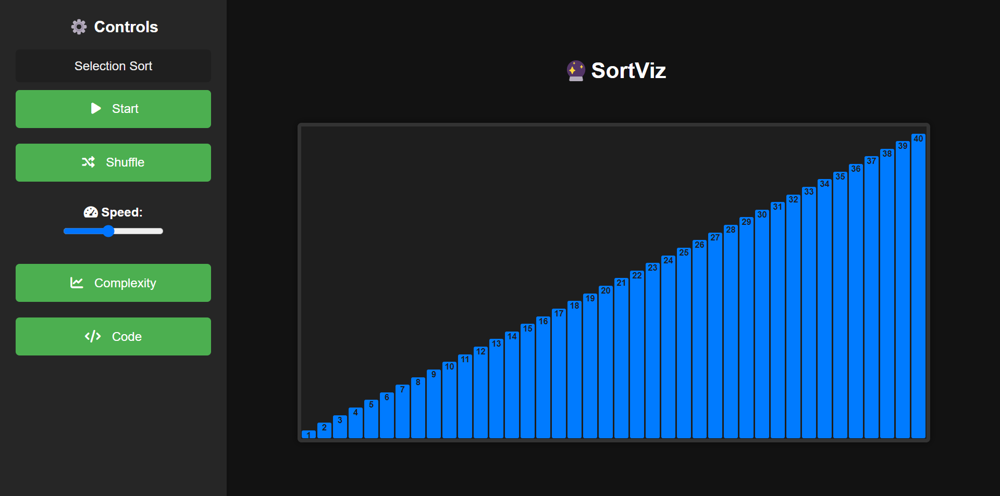

#  SortViz

SortViz is an overkill web application that visualizes sorting algorithms. Built using Go.



### Features
- Visualizes each step of the sorting process.
- Built with Go.
- Extendable with multiple sorting algorithms.

### Prerequisites
- Go 1.20 or later
- Make (optional, for using the Makefile)

### Installation
1. Clone the repository:
    ```bash
    git clone https://github.com/parthsolanke/SortViz.git
    ```
2. Navigate to the project directory:
    ```bash
    cd SortViz
    ```
3. Run the server:
    ```bash
    go run cmd/server/main.go
    ```
4. Open your browser and navigate to `http://localhost:8080`.

### Using the Makefile

#### Building the Project
To compile the Go application and create an executable binary:
```bash
make build
```

#### Running the Project
To build and run the application:
```bash
make run
```

After running, open your browser and navigate to `http://localhost:8080`.

#### Cleaning Up
To remove the generated binary and clean up the build directory:
```bash
make clean
```
## License
This project is licensed under the [MIT License](./LICENSE).
